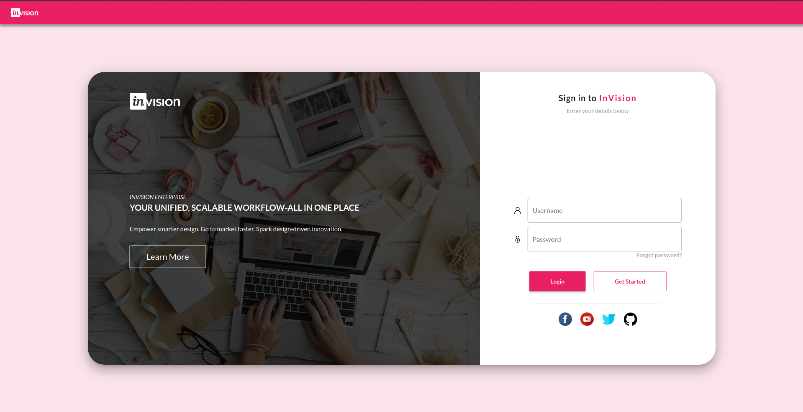
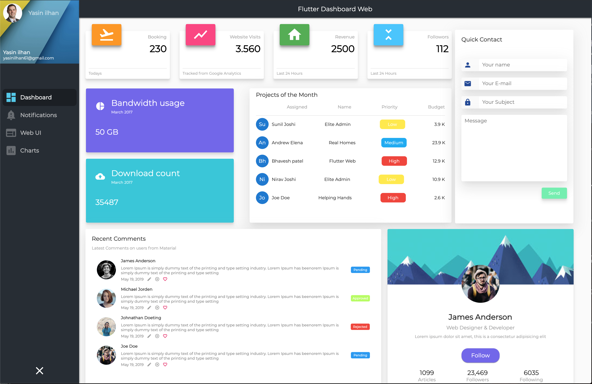
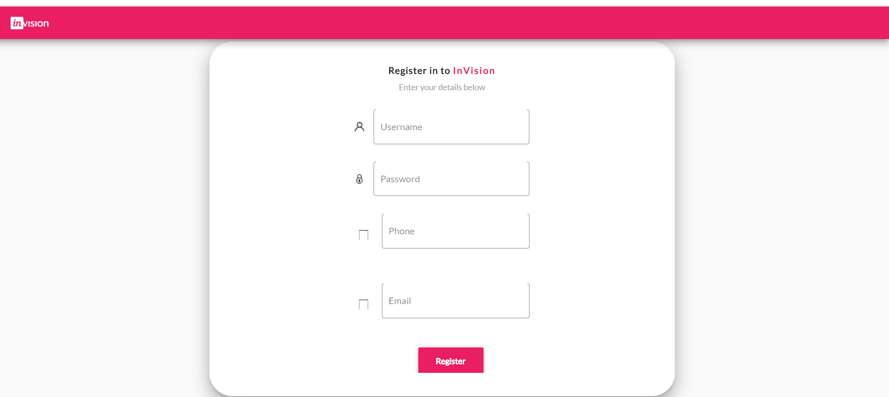

# Savitar-web

a project for flutter web

后端地址[here](https://github.com/dart4flutter/Savitar) 

online[here](https://www.rojackse.top:8080/login/#/)

在线演示[here](https://www.rojackse.top:8080/login/#/)

# 登录页

#登录成功

#注册页

#项目运行与发布

1、clone [here](https://github.com/dart4flutter/Savitar-web.git)

2、flutter packages get

3、 run(运行)： webdev serve

4、 open  http://localhost:8080/#/

5. build(打包)  ： webdev build -r ,you will get a build dir (打包后，会生成一个build目录，把目录内文件拷贝至web服务器中即可)

# Requirement

To run the code you need to have Flutter web installed as well as dart SDK, and of course a code editor( eg: VsCode)
运行此项目需要先安装dart, flutter-web

You can check Flutter web documentation [here](https://flutter.dev/web)
官方文档 [here](https://flutter.dev/web)

参考项目：
使用了该项目的页面[here](https://github.com/Otman404/InVision_loginPage)

使用了该项目的页面[here](https://github.com/kalismeras61/flutter_web_dashboard)
